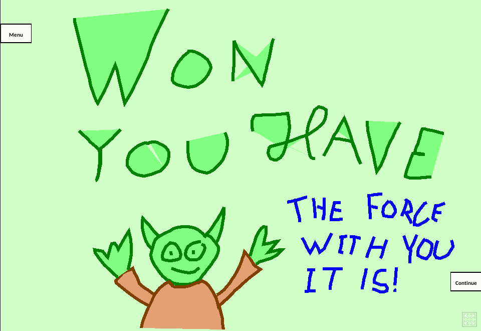

# GamePaint: Game.json
Simple level design done in [GamePaint](https://gamepaint.itch.io/gamepaint) following the Kishōtenketsu principle.

Play the game: [https://gamepaint.itch.io/gamepaint?game=https://raw.githubusercontent.com/eddex/GAMEDES-GamePaint/master/Game.json](https://gamepaint.itch.io/gamepaint?game=https://raw.githubusercontent.com/eddex/GAMEDES-GamePaint/master/Game.json)

<h4 align="center">
    
</h4>

# Twine: Heavy Trip - Jailbreak.html

A narrative game made with [Twine](http://twinery.org/) built upon the story of the movie [Heavy Trip](https://www.imdb.com/title/tt7220754/)

Play the game: [https://eddex.github.io/GAMEDES/Heavy Trip - Jailbreak.html](https://eddex.github.io/GAMEDES/Heavy%20Trip%20-%20Jailbreak.html)
